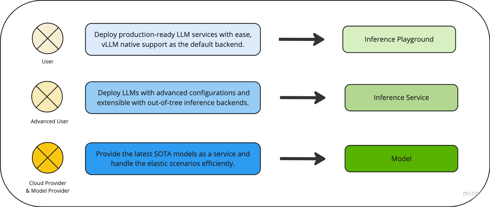

# llmaz

[](https://github.com/mkenney/software-guides/blob/master/STABILITY-BADGES.md#work-in-progress)
[![GoReport Widget]][GoReport Status]
[](https://github.com/inftyai/llmaz/releases/latest)

[GoReport Widget]: https://goreportcard.com/badge/github.com/inftyai/llmaz
[GoReport Status]: https://goreportcard.com/report/github.com/inftyai/llmaz

**llmaz** (pronounced `/lima:z/`), aims to provide a **Production-Ready** inference platform for large language models on Kubernetes. It closely integrates with state-of-the-art inference backends like [vLLM](https://github.com/vllm-project/vllm) to bring the leading-edge researches to cloud.

## Concept



## Feature Overview

- **User Friendly**: People can quick deploy a LLM service with minimal configurations.
- **High Performance**: llmaz supports a wide range of advanced inference backends for high performance, like [vLLM](https://github.com/vllm-project/vllm), [SGLang](https://github.com/sgl-project/sglang). Find the full list of supported backends [here](./docs/support-backends.md).
- **Scaling Efficiency (WIP)**: llmaz works smoothly with autoscaling components like [Cluster-Autoscaler](https://github.com/kubernetes/autoscaler/tree/master/cluster-autoscaler) or [Karpenter](https://github.com/kubernetes-sigs/karpenter) to support elastic scenarios.
- **Accelerator Fungibility (WIP)**: llmaz supports serving the same LLM with various accelerators to optimize cost and performance.
- **SOTA Inference (WIP)**: llmaz supports the latest cutting-edge researches like [Speculative Decoding](https://arxiv.org/abs/2211.17192) or [Splitwise](https://arxiv.org/abs/2311.18677) to run on Kubernetes.
- **Multi-hosts Support**: llmaz supports both single-host and multi-hosts scenarios with [LWS](https://github.com/kubernetes-sigs/lws) from day 1.

## Quick Start

### Installation

Read the [Installation](./docs/installation.md) for guidance.

### Deploy

Here's a simplest sample for deploying `facebook/opt-125m`, all you need to do
is to apply the `Model` and `Playground` yamls.

Please refer to **[examples](/docs/examples/README.md)** to learn more.

> Note: if your model needs Huggingface token for weight downloads, please run `kubectl create secret generic model-secret --from-literal=HF_TOKEN=<your token>` ahead.

#### Model

```yaml
apiVersion: llmaz.io/v1alpha1
kind: Model
metadata:
  name: opt-125m
spec:
  familyName: opt
  source:
    modelHub:
      modelID: facebook/opt-125m
  inferenceFlavors:
  - name: t4 # GPU type
    requests:
      nvidia.com/gpu: 1
```

#### Inference Playground

```yaml
apiVersion: inference.llmaz.io/v1alpha1
kind: Playground
metadata:
  name: opt-125m
spec:
  replicas: 1
  modelClaim:
    modelName: opt-125m
```

### Test

#### Expose the service

```cmd
kubectl port-forward pod/opt-125m-0 8080:8080
```

#### Get registered models

```cmd
curl http://localhost:8080/v1/models
```

#### Request a query

```cmd
curl http://localhost:8080/v1/completions \
-H "Content-Type: application/json" \
-d '{
    "model": "opt-125m",
    "prompt": "San Francisco is a",
    "max_tokens": 10,
    "temperature": 0
}'
```

## Roadmap

- Gateway support for traffic routing
- Serverless support for cloud-agnostic users
- CLI tool support
- Model training, fine tuning in the long-term

## Contributions

🚀 All kinds of contributions are welcomed ! Please follow [Contributing](https://github.com/InftyAI/community/blob/main/CONTRIBUTING.md). Thanks to all these contributors.

<a href="https://github.com/inftyai/llmaz/graphs/contributors">
  
</a>
