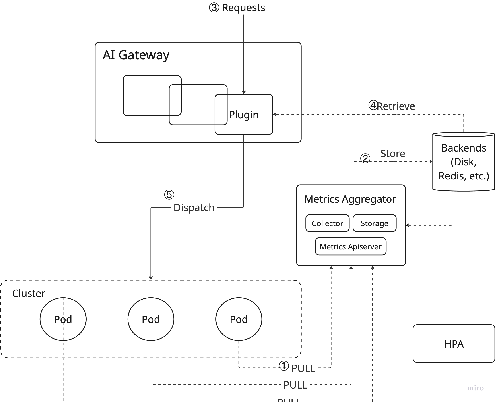

# Proposal-376: Gateway Metric Aggregator

<!--
This is the title of your Proposal. Keep it short, simple, and descriptive. A good
title can help communicate what the Proposal is and should be considered as part of
any review.
-->

<!--
A table of contents is helpful for quickly jumping to sections of a Proposal and for
highlighting any additional information provided beyond the standard Proposal
template.

Ensure the TOC is wrapped with
  <code>&lt;!-- toc --&rt;&lt;!-- /toc --&rt;</code>
tags, and then generate with `hack/update-toc.sh`.
-->

<!-- toc -->
- [Summary](#summary)
- [Motivation](#motivation)
  - [Goals](#goals)
  - [Non-Goals](#non-goals)
- [Proposal](#proposal)
  - [User Stories (Optional)](#user-stories-optional)
    - [Story 1](#story-1)
    - [Story 2](#story-2)
  - [Notes/Constraints/Caveats (Optional)](#notesconstraintscaveats-optional)
  - [Risks and Mitigations](#risks-and-mitigations)
- [Design Details](#design-details)
  - [Test Plan](#test-plan)
      - [Prerequisite testing updates](#prerequisite-testing-updates)
      - [Unit tests](#unit-tests)
      - [Integration tests](#integration-tests)
      - [e2e tests](#e2e-tests)
  - [Graduation Criteria](#graduation-criteria)
- [Implementation History](#implementation-history)
- [Drawbacks](#drawbacks)
- [Alternatives](#alternatives)
<!-- /toc -->

## Summary

<!--
This section is incredibly important for producing high-quality, user-focused
documentation such as release notes or a development roadmap. It should be
possible to collect this information before implementation begins, in order to
avoid requiring implementors to split their attention between writing release
notes and implementing the feature itself. Proposal editors and SIG Docs
should help to ensure that the tone and content of the `Summary` section is
useful for a wide audience.

A good summary is probably at least a paragraph in length.

Both in this section and below, follow the guidelines of the [documentation
style guide]. In particular, wrap lines to a reasonable length, to make it
easier for reviewers to cite specific portions, and to minimize diff churn on
updates.

-->

Metric-based scheduling is common in many systems, including Kubernetes. For GenAI, this becomes more complex because of the heavy computational requirements of models. This proposal outlines a design for a metric aggregator that can efficiently handle the unique challenges posed by GenAI workloads.

## Motivation

<!--
This section is for explicitly listing the motivation, goals, and non-goals of
this Proposal.  Describe why the change is important and the benefits to users. The
motivation section can optionally provide links to [experience reports] to
demonstrate the interest in a Proposal within the wider InftyAI community.

[experience reports]: https://github.com/golang/go/wiki/ExperienceReports
-->

With traditional services, because the final results will be generated in a very short time, common algorithms like round-robin or least-connection are enough.

However, in inference services, because of the heavy computations of the matrix multiplication, the result generation is often very slow, which is an essential difference with the traditional services. Therefore, we need more advanced algorithms to help us make wise scheduling decisions. For example, based on the inference engine's queue size, kv cache size, or combined metrics.

All these indicators should be collected from the inference engines for further analysis, that's why a metric aggregator is needed.

### Goals

<!--
List the specific goals of the Proposal. What is it trying to achieve? How will we
know that this has succeeded?
-->

- A simple implementation with least busy scheduling algorithm
- Extensible with different consumers in the cluster, like the Lora autoscaler or the ai gateway
- Metrics visualization support, like Grafana
- Metric management support, especially the gc policy

### Non-Goals

<!--
What is out of scope for this Proposal? Listing non-goals helps to focus discussion
and make progress.
-->

- Different scheduling algorithm implementations in ai gateway
- LoRA aware scheduling implementation, will be left to another KEP
- Performance consideration in big clusters should be left to the Beta level

## Proposal

<!--
This is where we get down to the specifics of what the proposal actually is.
This should have enough detail that reviewers can understand exactly what
you're proposing, but should not include things like API designs or
implementation. What is the desired outcome and how do we measure success?.
The "Design Details" section below is for the real
nitty-gritty.
-->

### User Stories (Optional)

<!--
Detail the things that people will be able to do if this Proposal is implemented.
Include as much detail as possible so that people can understand the "how" of
the system. The goal here is to make this feel real for users without getting
bogged down.
-->

#### Story 1

As a user, I hope my LLM request could be routed to the least-busy instance, so that I can get the result as soon as possible.

#### Story 2

As a RAG user, when retrieving documents, sometime they'are the same, so I hope my request could be routed to the instance with the most available kv cache to avoid the repetitive calculation, which is know as the prefix cache aware scheduling.

### Notes/Constraints/Caveats (Optional)

<!--
What are the caveats to the proposal?
What are some important details that didn't come across above?
Go in to as much detail as necessary here.
This might be a good place to talk about core concepts and how they relate.
-->

Metrics-based routing should meet the baseline requirements: even the metrics are unavailable or outdated, the system should still be able to work, despite the fact that the request response may be slower. For example, metrics-based lora scheduling is unfit here because once the metric indicates the wrong instance, we may hit 500 server error, it's unacceptable.

### Risks and Mitigations

<!--
What are the risks of this proposal, and how do we mitigate? Think broadly.
For example, consider both security and how this will impact the larger
InftyAI ecosystem.

How will security be reviewed, and by whom?

How will UX be reviewed, and by whom?

Consider including folks who also work outside the SIG or subproject.
-->

The metrics might be outdated or even unable to fetch, the router then may make suboptimal decisions, but as mentioned above, the system can still work with a slow response.

## Design Details

<!--
This section should contain enough information that the specifics of your
change are understandable. This may include API specs (though not always
required) or even code snippets. If there's any ambiguity about HOW your
proposal will be implemented, this is the place to discuss them.
-->

The overall flow looks like:

### Steps

Let's break down the flow into several steps:

- Step 1: we'll collect the metrics from the inference workloads, we choose `PUSH` mode here just to put less pressure on the gateway side, or the gateway will have iterate all the Pods which obviously will lead to performance issues.
- Step 2: the gateway plugin will parse the metrics and store them in the redis, this is for HA consideration and cache sharing. Once the instance is down, we can still retrieve the metrics from redis. And if we have multiple instances, we can share the metrics with each other via redis. Considering Envoy AI gateway already uses Redis for limit rating, we'll reuse the Redis here.
- Step 3 & 4: Traffic comes, and the Router will retrieve the metrics from Redis and make routing decisions based on different algorithms, like queue size aware scheduling.
- Step 5: The router will send the request to the selected instance, and the instance will return the result to the router, return to the user finally.

### Additional components introduced:

- Pod Sidecar: a sidecar container is necessary for each inference workload, which was introduced in Kubernetes 1.28 as alpha feature, and enabled by default in 1.29, see [details](https://kubernetes.io/blog/2023/08/25/native-sidecar-containers/). The sidecar will be responsible for collecting the metrics and pushing them to the AI gateway. Let's set the interval time to 100ms at first.
- Redis: a Redis instance is necessary for the metrics storage and sharing, we can use the existing Redis instance in the cluster, or deploy a new one if not available.
- Gateway Plugin: a new plugin or [DynamicLoadBalancingBackend](https://github.com/envoyproxy/ai-gateway/blob/be2b479b04bc7a219b0c8239143bfbabebdcd615/filterapi/filterconfig.go#L199-L208) specifically in Envoy AI gateway to pick the best-fit Pod endpoints. However, we may block by the upstream issue [here](https://github.com/envoyproxy/ai-gateway/issues/604), we'll work with the Envoy AI Gateway team to resolve it ASAP. Maybe the final design will impact our implementation a bit but not much I think.

### Data Structure

The data structure could be varied based on the metrics we want to collect, let's take the queue size as an example:

Because redis is a kv store, we'll use the ZSET to store the results, `LeastBusy::ModelName` as the key, Pod name as the member and the (runningQueueSize * 0.3 + waitingQueueSize * 0.7) as the score, the factor of waitingQueueSize is higher because metric is a delayed indicator. RunningQueueSize and WaitingQueueSize are two metrics most of the inference engines support.

Also set the expiration time to 500ms just in case the metric reporting is delayed and lead to the hotspot issue.

Note: the algorithm is not the final one, we'll have more discussions with the community to find the best one.

### Test Plan

<!--
**Note:** *Not required until targeted at a release.*
The goal is to ensure that we don't accept enhancements with inadequate testing.

All code is expected to have adequate tests (eventually with coverage
expectations).

[testing-guidelines]: https://git.k8s.io/community/contributors/devel/sig-testing/testing.md
-->

[x] I/we understand the owners of the involved components may require updates to
existing tests to make this code solid enough prior to committing the changes necessary
to implement this enhancement.

##### Prerequisite testing updates

<!--
Based on reviewers feedback describe what additional tests need to be added prior
implementing this enhancement to ensure the enhancements have also solid foundations.
-->

##### Unit tests

<!--
In principle every added code should have complete unit test coverage, so providing
the exact set of tests will not bring additional value.
However, if complete unit test coverage is not possible, explain the reason of it
together with explanation why this is acceptable.
-->

<!--
Additionally, for Alpha try to enumerate the core package you will be touching
to implement this enhancement and provide the current unit coverage for those
in the form of:
- <package>: <date> - <current test coverage>

This can inform certain test coverage improvements that we want to do before
extending the production code to implement this enhancement.
-->

- Hard to predict now since it's a new component, but try the best to make sure all the functionalities are covered.

##### Integration tests

<!--
Integration tests allow control of the configuration parameters used to start the binaries under test.
This is different from e2e tests which do not allow configuration of parameters.
Doing this allows testing non-default options and multiple different and potentially conflicting command line options.
-->

<!--
This question should be filled when targeting a release.
For Alpha, describe what tests will be added to ensure proper quality of the enhancement.

For Beta and GA, add links to added tests together with links to k8s-triage for those tests:
https://storage.googleapis.com/k8s-triage/index.html
-->

- By faking the metrics to make sure the router can pick the right instance.

##### e2e tests

<!--
This question should be filled when targeting a release.
For Alpha, describe what tests will be added to ensure proper quality of the enhancement.

For Beta and GA, add links to added tests together with links to k8s-triage for those tests:
https://storage.googleapis.com/k8s-triage/index.html

We expect no non-infra related flakes in the last month as a GA graduation criteria.
-->

- Add one e2e test to make sure the whole system can be launched via helm chart.
- For performance, we'll have benchmarks rather than e2e tests.

### Graduation Criteria

<!--

Clearly define what it means for the feature to be implemented and
considered stable.

If the feature you are introducing has high complexity, consider adding graduation
milestones with these graduation criteria:
- [Maturity levels (`alpha`, `beta`, `stable`)][maturity-levels]
- [Feature gate][feature gate] lifecycle
- [Deprecation policy][deprecation-policy]

[feature gate]: https://git.k8s.io/community/contributors/devel/sig-architecture/feature-gates.md
[maturity-levels]: https://git.k8s.io/community/contributors/devel/sig-architecture/api_changes.md#alpha-beta-and-stable-versions
[deprecation-policy]: https://kubernetes.io/docs/reference/using-api/deprecation-policy/
-->

Beta:

- No performance issues in big clusters, we may user daemonset to report metrics.
- Other storages rather than KV store who supports only key-value pairs which might be not enough for more complex scenarios.

## Implementation History

<!--
Major milestones in the lifecycle of a Proposal should be tracked in this section.
Major milestones might include:
- the `Summary` and `Motivation` sections being merged, signaling SIG acceptance
- the `Proposal` section being merged, signaling agreement on a proposed design
- the date implementation started
- the first llmaz release where an initial version of the Proposal was available
- the version of llmaz where the Proposal graduated to general availability
- when the Proposal was retired or superseded
-->

- 2025-05-08: Proposal initialized and submitted for review

## Drawbacks

<!--
Why should this Proposal _not_ be implemented?
-->

## Alternatives

<!--
What other approaches did you consider, and why did you rule them out? These do
not need to be as detailed as the proposal, but should include enough
information to express the idea and why it was not acceptable.
-->
